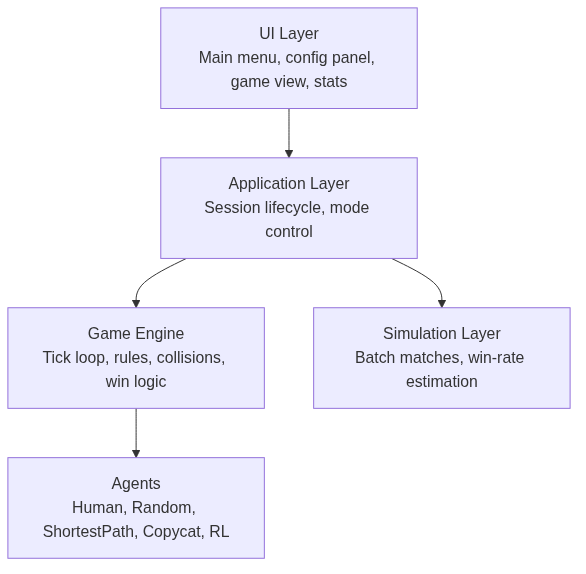
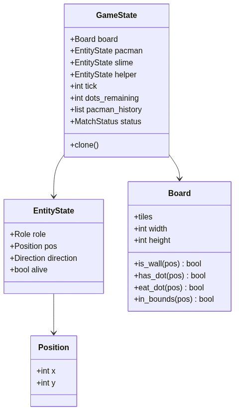
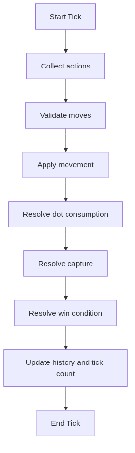
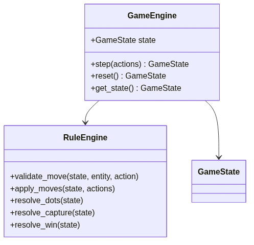
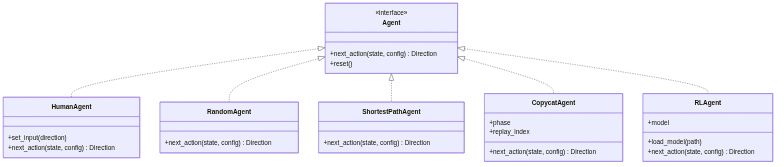
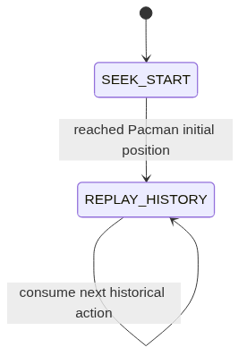
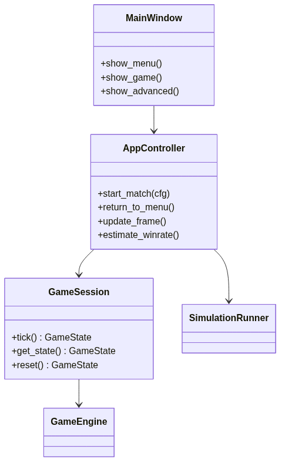
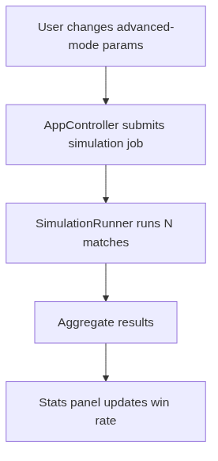

# pacman_duel Design

## 1. Overview

`pacman_duel` is a local-first duel game built around a Pacman-style board, two opposing sides, and pluggable AI strategies.

- Pacman wins by eating all dots.
- The enemy side wins when either the slime or helper catches Pacman.
- If Pacman eats the last dot on the same tick that an enemy catches Pacman, Pacman wins.
- The system must support `Human vs AI`, `AI vs Human`, and `AI vs AI`.
- Advanced mode must support algorithm-specific parameters and estimated win rate display.

The design should prioritize:

- clean separation between game rules, AI logic, simulation, and UI
- fast iteration for algorithms such as BFS and reinforcement learning
- desktop GUI support with Wayland compatibility
- testability of the core game rules without UI dependencies

## 2. Recommended Tech Stack

### Primary stack

- Language: `Python 3.12+`
- GUI: `PySide6`
- Numeric utilities: `numpy`
- Validation/config schemas: `pydantic` or `dataclasses`
- Testing: `pytest`

### Optional later additions

- Reinforcement learning: `stable-baselines3`, `gymnasium`
- Packaging: `pyinstaller` or `briefcase`
- Web version later: `FastAPI + WebSocket` backend or a dedicated TypeScript frontend

### Why this stack

- `PySide6` is a better fit than a game-only library for menus, parameter panels, and win-rate displays.
- Python keeps pathfinding, simulation, and AI iteration cheap.
- The game is small enough that Python performance should be sufficient if the core loop is kept simple.

### Pros

- Fast to prototype and extend
- Good fit for algorithm experimentation
- Strong separation between pure game logic and UI
- Easy to unit test

### Cons

- Desktop-first architecture is not the most natural base for a web-first product
- Python has lower performance headroom than Rust/C++
- RL training may require process/thread separation later

## 3. Architecture Summary

The system is split into five major layers:

1. `Core Game Engine`
2. `Agents / AI`
3. `Simulation / Statistics`
4. `UI Layer`
5. `Application Orchestration`



Source: `docs/diagrams/mermaid/architecture.mmd`

## 4. Directory Layout

```text
pacman_duel/
  src/
    app.py
    core/
      board.py
      models.py
      rules.py
      engine.py
      pathfinding.py
    agents/
      base.py
      human.py
      random_agent.py
      shortest_path.py
      copycat.py
      rl_agent.py
    sim/
      runner.py
      winrate.py
    ui/
      main_window.py
      menu_screen.py
      config_panel.py
      game_view.py
      stats_panel.py
    config/
      schemas.py
      presets.py
  tests/
    test_rules.py
    test_pathfinding.py
    test_agents.py
    test_win_conditions.py
```

## 5. Core Domain Model

The game should be a fixed-tick, grid-based state machine.

### Main entities

- `Pacman`
- `Slime`
- `Helper`
- `Board`
- `Dots`

### Core model responsibilities

- `Position`: immutable grid coordinates
- `EntityState`: per-character runtime state
- `Board`: walls, dots, bounds checks
- `GameState`: full snapshot of the match



Source: `docs/diagrams/mermaid/domain_model.mmd`

### Suggested enums

- `Direction`: `UP`, `DOWN`, `LEFT`, `RIGHT`, `STAY`
- `Role`: `PACMAN`, `SLIME`, `HELPER`
- `MatchStatus`: `RUNNING`, `PACMAN_WIN`, `ENEMY_WIN`
- `Tile`: `WALL`, `DOT`, `EMPTY`

## 6. Engine and Rules

The engine owns state transitions. The rules layer owns the detailed mechanics.

### Tick order

1. Collect actions from all active controllers
2. Validate requested movement
3. Apply movement
4. Resolve dot consumption
5. Resolve capture
6. Resolve win/loss
7. Persist history needed by agents such as `Copycat`



Source: `docs/diagrams/mermaid/tick_flow.mmd`

### Main classes



Source: `docs/diagrams/mermaid/engine_rules.mmd`

### Important rule decisions

- Invalid movement becomes `STAY`.
- The helper always exists as part of the enemy side.
- The helper uses shortest-path behavior by default.
- If final-dot consumption and capture happen on the same tick, Pacman wins.
- `q` and `esc` are UI-level controls, not core rule logic.

## 7. Agent Design

Agents must not mutate the game state. They only return an action for the current tick.

### Agent interface

```python
class Agent(Protocol):
    def next_action(self, state: GameState, config: dict) -> Direction: ...
    def reset(self) -> None: ...
```

### Agent hierarchy



Source: `docs/diagrams/mermaid/agent_hierarchy.mmd`

### Built-in strategies

#### `HumanAgent`

- Reads last valid input from UI
- Should be independent from direct widget logic

#### `RandomAgent`

- Chooses randomly from legal actions
- Useful as baseline and for smoke testing

#### `ShortestPathAgent`

- Uses BFS
- Slime target: current Pacman position
- Helper target: current Pacman position
- Configurable tie-breaking can be added later

#### `CopycatAgent`

Two-phase behavior:

1. Move toward Pacman's initial position
2. Replay Pacman's historical actions exactly, including optional `STAY`



Source: `docs/diagrams/mermaid/copycat_state.mmd`

#### `RLAgent`

- Keep interface stable first
- A stub implementation is acceptable in the first milestone
- Training should stay outside the real-time UI loop

## 8. Application and Session Layer

The application layer coordinates screens, match setup, and session lifetime.



Source: `docs/diagrams/mermaid/app_session.mmd`

### Responsibilities

#### `MainWindow`

- owns current screen/widget tree
- routes menu and navigation events

#### `AppController`

- creates and destroys sessions
- translates UI selections into runtime configuration
- drives frame updates
- triggers win-rate estimation jobs

#### `GameSession`

- bundles one match config, its agents, and its engine
- provides the per-tick interface used by the UI timer

## 9. Simulation and Win-Rate Estimation

Advanced mode requires many automated matches using the current parameter set.

### Why it is a separate layer

- simulation should not block the UI thread
- bulk matches should reuse the same engine/rule system as real gameplay
- statistics should be deterministic under a fixed seed

### Main interface

```python
class SimulationRunner:
    def run_match(self, config: MatchConfig) -> MatchResult: ...
    def run_batch(self, config: MatchConfig, rounds: int) -> BatchResult: ...
```

### Result models

- `MatchResult`
  - winner
  - tick_count
  - optional replay summary

- `BatchResult`
  - `pacman_win_rate`
  - `enemy_win_rate`
  - `avg_ticks`
  - `samples`



Source: `docs/diagrams/mermaid/simulation_flow.mmd`

## 10. UI Design

The UI should stay thin. It renders state and captures input, but it does not implement game rules.

### Main screens

- `MainMenu`
  - start game
  - advanced mode
  - quit

- `ModeConfigPanel`
  - choose controller for Pacman and Slime
  - choose AI algorithm for each AI-controlled side
  - show algorithm parameter controls

- `AdvancedPanel`
  - shows parameter editor
  - runs win-rate estimation
  - displays summary stats

- `GameView`
  - draws board and entities
  - receives keyboard input
  - supports `q` / `esc` to return to menu

## 11. Configuration Model

Advanced mode should be schema-driven so the UI can build parameter forms dynamically.

```python
class AgentConfig(BaseModel):
    controller_type: str
    algorithm: str
    params: dict[str, Any]


class MatchConfig(BaseModel):
    pacman_config: AgentConfig
    slime_config: AgentConfig
    helper_config: AgentConfig
    tick_ms: int = 120
    board_preset: str = "default"
```

### Benefits

- one shared config format for UI, game runtime, and simulations
- easy preset serialization
- algorithm-specific forms can be generated from metadata

## 12. Concurrency Model

### Real-time match

- UI thread owns Qt event loop
- `QTimer` triggers game ticks
- each tick reads current inputs and advances one frame

### Simulation jobs

- background worker thread or thread pool
- no UI calls inside simulation workers
- results pushed back to UI safely after completion

### Future RL training

- use a dedicated process if training becomes heavy
- keep training outside the play session lifecycle

## 13. Testing Strategy

The core logic must be tested independently from the GUI.

### Priority test areas

#### Rules

- illegal movement becomes `STAY`
- dot consumption decrements `dots_remaining`
- simultaneous final-dot and capture resolves to Pacman win

#### Pathfinding

- BFS returns the shortest valid route
- BFS handles blocked targets cleanly

#### Agents

- `RandomAgent` only returns legal actions
- `ShortestPathAgent` reduces distance when path exists
- `CopycatAgent` switches from seek mode to replay mode correctly

#### Simulation

- batch counts are correct
- seeded runs are reproducible

## 14. Suggested Implementation Plan

### Milestone 1

- implement `Board`, `GameState`, `RuleEngine`, `GameEngine`
- implement `HumanAgent`, `RandomAgent`, `ShortestPathAgent`
- build basic menu and game view

### Milestone 2

- implement `CopycatAgent`
- add advanced mode configuration UI
- add `SimulationRunner` and win-rate display

### Milestone 3

- add `RLAgent` integration
- add preset save/load
- refine balancing and parameter tuning

## 15. Design Constraints and Principles

- Keep `GameState` independent from UI frameworks.
- Keep rules deterministic where possible.
- Reuse the same engine for both gameplay and simulation.
- Prefer pure functions or stateless services in the rules layer.
- Do not let agents mutate state directly.
- Keep RL support behind a stable interface so it can remain optional early on.
