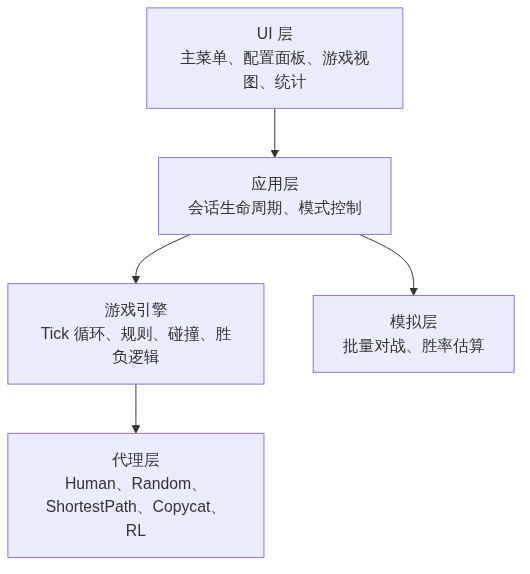
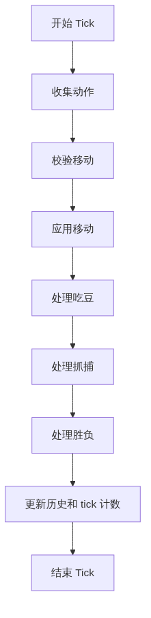
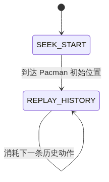
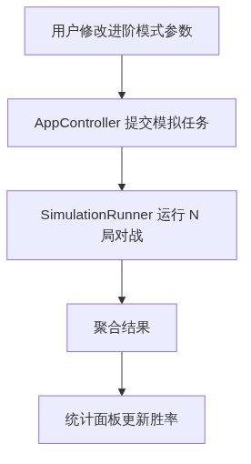

# pacman_duel 设计文档

## 1. 概述

`pacman_duel` 是一个本地优先的对战游戏，基于类似吃豆人的棋盘、两个对立阵营，以及可插拔的 AI 策略。

- Pacman 的胜利条件是吃掉所有豆子。
- 敌方的胜利条件是史莱姆或助手抓到 Pacman。
- 如果 Pacman 在同一个 tick 中既吃掉最后一颗豆，又被敌方抓到，则判定 Pacman 获胜。
- 系统必须支持 `Human vs AI`、`AI vs Human` 和 `AI vs AI`。
- 进阶模式必须支持按算法显示参数，并展示估算胜率。

设计目标应优先保证：

- 游戏规则、AI 逻辑、模拟统计和 UI 之间清晰解耦
- BFS 和强化学习等算法可以快速迭代
- 桌面 GUI 支持 Wayland
- 核心游戏规则可以脱离 UI 单独测试

## 2. 推荐技术栈

### 主技术栈

- 语言：`Python 3.12+`
- GUI：`PySide6`
- 数值工具：`numpy`
- 配置与校验：`pydantic` 或 `dataclasses`
- 测试：`pytest`

### 后续可选扩展

- 强化学习：`stable-baselines3`、`gymnasium`
- 打包：`pyinstaller` 或 `briefcase`
- 网页版本：`FastAPI + WebSocket` 后端，或后续单独实现 TypeScript 前端

### 为什么选择这套

- `PySide6` 比纯游戏库更适合菜单、参数面板和胜率展示等界面。
- Python 适合快速实现路径搜索、仿真和 AI 算法迭代。
- 这个项目规模不大，只要主循环保持简洁，Python 的性能通常足够。

### 优点

- 原型开发快，扩展快
- 非常适合算法实验
- 游戏核心和 UI 易于分层
- 单元测试成本低

### 缺点

- 如果以后转成网页优先，这套桌面优先架构不是最自然的起点
- Python 的性能上限低于 Rust/C++
- 后续 RL 训练可能需要额外的线程或进程隔离

## 3. 架构总览

系统拆分为五个主要层次：

1. `Core Game Engine`
2. `Agents / AI`
3. `Simulation / Statistics`
4. `UI Layer`
5. `Application Orchestration`



源文件：`docs/diagrams/mermaid/architecture_cn.mmd`

## 4. 目录结构

```text
pacman_duel/
  src/
    app.py
    core/
      board.py
      models.py
      rules.py
      engine.py
      pathfinding.py
    agents/
      base.py
      human.py
      random_agent.py
      shortest_path.py
      copycat.py
      rl_agent.py
    sim/
      runner.py
      winrate.py
    ui/
      main_window.py
      menu_screen.py
      config_panel.py
      game_view.py
      stats_panel.py
    config/
      schemas.py
      presets.py
  tests/
    test_rules.py
    test_pathfinding.py
    test_agents.py
    test_win_conditions.py
```

## 5. 核心领域模型

游戏应建模为一个固定 tick 的网格状态机。

### 主要实体

- `Pacman`
- `Slime`
- `Helper`
- `Board`
- `Dots`

### 核心模型职责

- `Position`：不可变的网格坐标
- `EntityState`：角色的运行时状态
- `Board`：墙体、豆子、边界检查
- `GameState`：一局游戏的完整快照


源文件：`docs/diagrams/mermaid/domain_model.mmd`

### 建议使用的枚举

- `Direction`：`UP`、`DOWN`、`LEFT`、`RIGHT`、`STAY`
- `Role`：`PACMAN`、`SLIME`、`HELPER`
- `MatchStatus`：`RUNNING`、`PACMAN_WIN`、`ENEMY_WIN`
- `Tile`：`WALL`、`DOT`、`EMPTY`

## 6. 引擎与规则

引擎负责状态推进，规则层负责具体机制。

### Tick 执行顺序

1. 收集所有控制方动作
2. 校验请求的移动是否合法
3. 应用移动
4. 处理豆子消耗
5. 处理抓捕判定
6. 处理胜负判定
7. 记录 `Copycat` 等算法需要使用的历史信息



源文件：`docs/diagrams/mermaid/tick_flow_cn.mmd`

### 主要类


源文件：`docs/diagrams/mermaid/engine_rules.mmd`

### 重要规则决策

- 非法移动会被转成 `STAY`
- 助手始终属于敌方阵营的一部分
- 助手默认使用最短路径策略
- 如果吃掉最后一颗豆和被抓发生在同一个 tick，则 Pacman 获胜
- `q` 和 `esc` 属于 UI 层控制，不属于核心规则

## 7. Agent 设计

Agent 不能直接修改游戏状态，只能返回当前 tick 要执行的动作。

### Agent 接口

```python
class Agent(Protocol):
    def next_action(self, state: GameState, config: dict) -> Direction: ...
    def reset(self) -> None: ...
```

### Agent 层级


源文件：`docs/diagrams/mermaid/agent_hierarchy.mmd`

### 内置策略

#### `HumanAgent`

- 从 UI 读取最后一次有效输入
- 不应该直接依赖具体 widget 逻辑

#### `RandomAgent`

- 从合法动作中随机选择
- 适合作为 baseline 和基础 smoke test

#### `ShortestPathAgent`

- 使用 BFS
- 史莱姆目标：当前 Pacman 位置
- 助手目标：当前 Pacman 位置
- 后续可以增加平局时的 tie-break 配置

#### `CopycatAgent`

分两阶段执行：

1. 先移动到 Pacman 初始位置
2. 然后精确回放 Pacman 的历史动作，必要时也回放 `STAY`



源文件：`docs/diagrams/mermaid/copycat_state_cn.mmd`

#### `RLAgent`

- 先把接口稳定下来
- 第一阶段允许只是一个占位实现
- 训练过程不应放在实时 UI 循环里

## 8. 应用层与会话层

应用层负责屏幕切换、对局初始化和会话生命周期。


源文件：`docs/diagrams/mermaid/app_session.mmd`

### 职责划分

#### `MainWindow`

- 管理当前 screen 或 widget 树
- 路由菜单和页面切换事件

#### `AppController`

- 创建和销毁会话
- 把 UI 的选项转换成运行时配置
- 驱动逐帧更新
- 提交胜率估算任务

#### `GameSession`

- 聚合一局游戏的配置、agents 和 engine
- 提供给 UI 定时器使用的逐 tick 接口

## 9. 模拟层与胜率估算

进阶模式的胜率展示需要批量自动对战。

### 为什么它必须独立成层

- 模拟不能阻塞 UI 线程
- 批量对战必须复用和实时对局相同的引擎与规则
- 固定随机种子时，统计结果应可复现

### 主要接口

```python
class SimulationRunner:
    def run_match(self, config: MatchConfig) -> MatchResult: ...
    def run_batch(self, config: MatchConfig, rounds: int) -> BatchResult: ...
```

### 结果模型

- `MatchResult`
  - winner
  - tick_count
  - 可选 replay 摘要

- `BatchResult`
  - `pacman_win_rate`
  - `enemy_win_rate`
  - `avg_ticks`
  - `samples`



源文件：`docs/diagrams/mermaid/simulation_flow_cn.mmd`

## 10. UI 设计

UI 应保持轻量。它只负责渲染状态和采集输入，不负责实现游戏规则。

### 主要页面

- `MainMenu`
  - 开始游戏
  - 进阶模式
  - 退出

- `ModeConfigPanel`
  - 选择 Pacman 和 Slime 的控制方式
  - 给 AI 控制的一方选择算法
  - 显示算法参数控件

- `AdvancedPanel`
  - 显示参数编辑器
  - 触发胜率估算
  - 展示统计结果

- `GameView`
  - 绘制棋盘和角色
  - 接收键盘输入
  - 支持 `q` / `esc` 返回主菜单

## 11. 配置模型

进阶模式建议采用 schema 驱动的配置方式，这样 UI 可以动态生成参数表单。

```python
class AgentConfig(BaseModel):
    controller_type: str
    algorithm: str
    params: dict[str, Any]


class MatchConfig(BaseModel):
    pacman_config: AgentConfig
    slime_config: AgentConfig
    helper_config: AgentConfig
    tick_ms: int = 120
    board_preset: str = "default"
```

### 好处

- UI、运行时和模拟层共用同一种配置格式
- 很容易做 preset 序列化
- 可以根据元数据动态生成算法参数表单

## 12. 并发模型

### 实时对局

- UI 线程运行 Qt 事件循环
- 用 `QTimer` 触发游戏 tick
- 每个 tick 读取当前输入并推进一帧

### 模拟任务

- 放在后台线程或线程池中运行
- 模拟线程里不能直接操作 UI
- 完成后以安全方式把结果发回 UI

### 未来 RL 训练

- 如果训练开销较大，建议使用独立进程
- 训练过程不应耦合进实时游玩会话

## 13. 测试策略

核心逻辑必须脱离 GUI 独立测试。

### 优先测试区域

#### 规则

- 非法移动是否变成 `STAY`
- 吃豆是否正确减少 `dots_remaining`
- 最后一颗豆与抓捕同时发生时是否正确判 Pacman 赢

#### 路径搜索

- BFS 是否返回最短合法路径
- 目标不可达时是否能正确处理

#### Agent

- `RandomAgent` 是否只返回合法动作
- `ShortestPathAgent` 在有路径时是否会缩短距离
- `CopycatAgent` 是否正确从 seek 模式切换到 replay 模式

#### 模拟统计

- 批量统计的局数是否正确
- 固定随机种子时结果是否可复现

## 14. 建议的实现计划

### 里程碑 1

- 实现 `Board`、`GameState`、`RuleEngine`、`GameEngine`
- 实现 `HumanAgent`、`RandomAgent`、`ShortestPathAgent`
- 搭建基础菜单和游戏视图

### 里程碑 2

- 实现 `CopycatAgent`
- 增加进阶模式配置 UI
- 增加 `SimulationRunner` 和胜率展示

### 里程碑 3

- 接入 `RLAgent`
- 增加 preset 的保存与加载
- 调整平衡性和参数

## 15. 设计约束与原则

- `GameState` 必须独立于 UI 框架。
- 规则层应尽量保持确定性。
- 实时对局和批量模拟必须复用同一个引擎。
- 规则层优先使用纯函数或无状态服务。
- Agent 不允许直接修改状态。
- RL 支持必须放在稳定接口之后，早期应保持可选。
